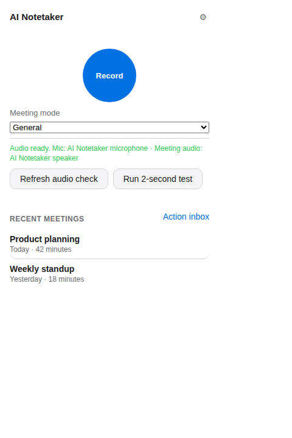

# AI Notetaker

Private, botless meeting notes: no bot joins your call.

AI Notetaker records your microphone and the meeting audio, turns the
conversation into a transcript, and produces a summary with action items. It
is open source and local-first. Use it free with your own API keys and no
account, or sign in to the paid hosted service and let it handle the AI
providers and usage billing for you.

<p align="center">
  
</p>

> **Status:** there is no public release yet. The Chrome Web Store listing,
> signed installers, and package-manager submissions still need release-owner
> credentials and external review, and hosted mode is not yet advertised as
> released. Anything below labeled "when released" describes the planned
> channel; today you run AI Notetaker from source. See the
> [code-signing policy](docs/code-signing-policy.md) and
> [unsigned-install guide](docs/unsigned-install.md).

## Quickstart: Google Meet in 60 seconds

Google Meet needs only Chrome and the extension. No helper, no audio routing.

1. Install the extension (Chrome Web Store when released; until then
   [load it from source](#install-the-extension)). Installing opens setup
   automatically.
2. On the one setup screen, choose **Use my own API keys (free)** and paste a
   transcription key and a summarization key, or choose **Hosted (paid)** and
   sign in. Allow the microphone and tick the one-line consent box.
3. Click **Finish**, then **Open Google Meet**.
4. In a call, press **Alt+Shift+R** (or click the toolbar icon) to start
   notes. Press it again, or just hang up, to stop and finalize them.
5. Click the **Notes ready** notification to open your summary, action items,
   and transcript.

Full details are in [`docs/getting-started.md`](docs/getting-started.md).

## What you get

- A transcript after Google Meet capture stops; desktop calls also support
  live transcription through the helper.
- A summary and action items when you stop.
- Meeting history and notes pages stored locally by default, with search.
- Notes styles (General, Standup, Sales call, 1:1, Interview, or your own),
  custom vocabulary, and summary instructions.
- Crash recovery and a retry queue, so a provider outage never loses audio.
- Optional Google Docs/Drive export and Markdown, text, or print/PDF export.
- An optional self-hosted webapp for authenticated, cross-device history.
- A hosted (paid) service foundation: workspace history, sharing, recording
  downloads, and usage limits. Real deployment, provider, and billing
  acceptance is still a separate release gate.

## What you need

| You want to record | You need |
| --- | --- |
| **Google Meet** in Chrome | Chrome, the extension, and either two provider API keys (free mode) or a hosted account. |
| **Zoom, Teams, Slack huddles**, or other desktop calls | All of the above, plus the desktop helper and a system-audio source: ScreenCaptureKit on macOS 13+, WASAPI loopback on Windows, or a PipeWire/PulseAudio monitor on Linux. BlackHole (macOS), base VB-CABLE (Windows), and a null sink (Linux) are documented fallbacks only. |

In both cases, get permission from the people you record where local law
requires it. AI Notetaker does not bundle a custom audio driver; see the
[audio setup guide](docs/helper-packaging.md) for the fallbacks.

## Install the extension

Install **AI Notetaker** from the Chrome Web Store when the listing is
published. Chrome does not allow a native desktop installer to silently install
an extension, so the extension is always installed from the store or loaded
manually.

To run from source today:

```sh
cd extension
npm install
npm run build
```

Then open `chrome://extensions`, turn on **Developer mode**, choose **Load
unpacked**, and select `extension/dist/`.

The extension ID is intentionally stable: `jidooookkdbbbhkkdmcajnnnhhphodok`.
Do not replace the committed `key` in `extension/manifest.json`; the helper
allowlists this ID.

## Desktop calls: install the helper

Only needed for Zoom, Teams, Slack, and other desktop apps. When a release is
published, use the package manager for your OS:

```sh
# macOS (when released)
brew install --cask ai-notetaker

# Windows PowerShell (when released)
winget install AI.Notetaker
# or: choco install ai-notetaker

# Linux (when released): download the .deb from the release page, then
sudo apt install ./AI-Notetaker_<version>_amd64.deb
```

Launch **AI Notetaker** once so its tray process is running. Upgrade with the
same channel you installed from (`brew upgrade --cask ai-notetaker`,
`winget upgrade AI.Notetaker`, or `choco upgrade ai-notetaker`).

Until a release exists, follow the contributor
[source-build path](docs/getting-started.md#build-from-source). Running
`cargo build` alone does not make Chrome find the helper. Audio setup for each
OS and app is in
[`docs/getting-started.md`](docs/getting-started.md#desktop-calls-zoom-teams-slack).

## How the pieces fit together

| Piece | What it does |
| --- | --- |
| Chrome extension | Owns botless Google Meet capture, local-first browser processing, setup, notes, settings, meetings, and action items. |
| Desktop helper (desktop calls only) | A Rust/Tauri tray app for native microphone and system-audio capture, local storage, processing, retries, and recovery on Zoom, Teams, Slack, and other desktop calls. |
| History service (optional) | Your own self-hosted webapp, or the hosted workspace, depending on the mode you choose. |

The extension talks to the helper through Chrome Native Messaging and a local
Unix socket or Windows named pipe. It does not open a TCP/localhost server.
Your own API keys stay in `chrome.storage.local`; hosted provider keys stay on
the server.

## Terms

User-facing language is deliberately plain: **Start notes / Stop notes**,
**Notes style**, **Use my own API keys (free)**, and **Hosted (paid)**.
"Managed" and "BYOK" are internal engineering terms. See the
[glossary](docs/getting-started.md#terms-used-in-the-product).

## Provider costs and privacy

With **Use my own API keys (free)**, you bring the keys and pay the providers
directly. With **Hosted (paid)**, the service owns the provider credentials,
applies usage limits, and bills your workspace through its payment provider.
Provider and hosted-plan pricing can change, so check the current plan before
relying on an estimate.

Raw microphone and speaker audio is saved locally before any provider call so
interrupted requests can be retried. With your own keys, the project does not
receive your audio, transcripts, keys, or telemetry. With hosted, audio and the
resulting notes leave your device only for the hosted service, after local
saving; review its retention and deletion policy. See
[`docs/data-handling.md`](docs/data-handling.md) for storage and deletion
details.

## Optional: history on your own server

The extension always keeps local meeting history. For authenticated,
cross-device history, either deploy the optional self-hosted webapp and paste
its URL plus access token into Settings, or sign in to the hosted service and
use its workspace history and billing controls.

This is not required for recording, and the webapp never needs your AI
provider keys. See [`webapp/README.md`](webapp/README.md) for local and
Railway deployment instructions.

## If something is not working

- **Nothing happens on Alt+Shift+R:** Chrome only assigns the shortcut when
  it is free. Check `chrome://extensions/shortcuts`, or use the toolbar icon.
- **Chrome will not capture the Meet tab:** click the AI Notetaker toolbar
  icon once on the Meet tab, then start notes again.
- **Provider test fails:** verify that the key belongs to the selected
  provider tier and test it again in Settings. Do not put provider keys in
  the webapp.
- **A recording was interrupted:** use the popup's **Resume** or **Discard**
  banner. The raw audio is kept locally for recovery.
- **Desktop calls only, "Helper not detected" or "Audio needs attention":**
  launch the tray helper and reload the extension; if you built from source,
  install the helper package or register its Native Messaging manifest (the two
  binaries are `notetaker-helper` and `notetaker-nm-host`). Then re-run the
  audio check. These do not apply to Google Meet.

The detailed troubleshooting flow is in [`docs/getting-started.md`](docs/getting-started.md#troubleshooting).

## For contributors

The living roadmap is [`TODO.md`](TODO.md). Contribution setup, architecture
boundaries, required checks, and pull-request expectations are in
[`CONTRIBUTING.md`](CONTRIBUTING.md); release evidence and external gates are
kept explicit there and in the roadmap.

```sh
cd helper && cargo fmt --all -- --check && cargo clippy --workspace --all-targets -- -D warnings && cargo test --workspace
cd ../extension && npm run typecheck && npm test && npm run build
cd ../webapp && npx prisma generate && npm run test:with-postgres && npm run build
```

Package-specific notes live in [`extension/README.md`](extension/README.md),
[`helper/README.md`](helper/README.md), and [`webapp/README.md`](webapp/README.md).
Coverage commands and the distinction between deterministic tests and real
OS/browser/provider validation are in [`docs/testing.md`](docs/testing.md).
The target architecture is
[`docs/superpowers/specs/2026-09-24-scribbl-dual-mode-product-design.md`](docs/superpowers/specs/2026-09-24-scribbl-dual-mode-product-design.md);
the [2026-09-21 architecture](docs/superpowers/specs/2026-09-21-notetaker-architecture-design.md)
is the historical baseline.

## License

MIT — see [`LICENSE`](LICENSE).
