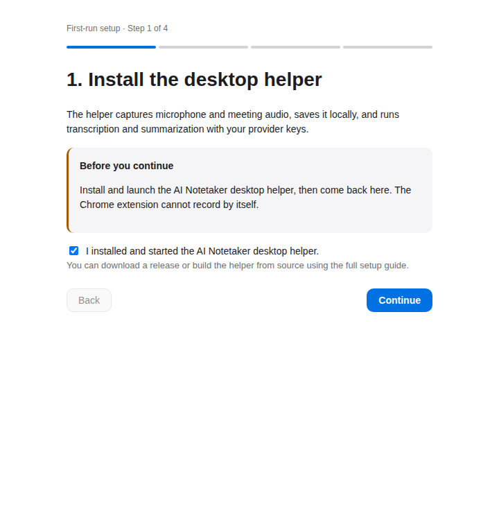

# AI Notetaker

Private meeting notes from the desktop you already use.

AI Notetaker records the microphone and meeting audio, turns the conversation
into a transcript, and produces a summary with action items. It is open
source, local-first, and uses your own AI provider keys. There is no account,
subscription, or project-operated backend.

<p align="center">
  
</p>

## Start here

The normal user flow is:

1. Install and start the desktop helper.
2. Install the Chrome extension.
3. Follow the four-step setup wizard.
4. Select the AI Notetaker audio devices in your meeting app.
5. Check audio, click **Record**, and stop when the meeting ends.

The easiest install is the published native helper for your OS plus the
Chrome Web Store extension. The full, copy-and-paste setup—including package
manager install and upgrade commands—is in
[`docs/getting-started.md`](docs/getting-started.md).

The production distribution model is documented in the
[distribution and installation architecture](docs/superpowers/specs/2026-09-21-distribution-and-installation-architecture.md): native helper
installers/package-manager channels for capture, with Docker reserved for the
optional self-hosted history webapp.

> **Current project status:** the release workflow is configured to build and
> publish release assets and the optional webapp image from a version tag, but
> the repository currently has no public release. The first public signed
> release, Chrome Web Store listing, and package-manager submissions still
> require release-owner credentials and external review. Until those are
> complete, the install page correctly directs users to the source-build or
> development-extension path. See the [code-signing policy](docs/code-signing-policy.md)
> and [unsigned-install guide](docs/unsigned-install.md) for the development
> fallback and the separate signed-release requirements.

## What it feels like

The first-run wizard keeps setup in one place. It tells you what to install,
checks that both microphone and meeting audio are visible, lets you add and
test your provider keys, and asks you to acknowledge recording consent.



Once setup is complete, the extension popup is the everyday control surface.
The **Record** button stays disabled until the helper and both audio channels
are ready. You can choose a meeting mode, run a two-second audio test, see
recent meetings, and open the action-item inbox.

These screenshots show the built extension UI and its documented states. A
real provider call, OS audio driver, and live meeting still need to be tested
on the machine where you use the app.

## What you get

- A live transcript while you record.
- A meeting summary and action items after you stop.
- Meeting history and detail pages stored locally by default.
- Custom meeting modes, vocabulary, and summary instructions.
- Crash recovery and a retry queue for provider interruptions.
- An optional self-hosted webapp for authenticated, cross-device history.

## How the pieces fit together

AI Notetaker has two required pieces and one optional piece:

| Piece | What it does |
| --- | --- |
| Desktop helper | A Rust/Tauri tray app that owns audio capture, local storage, transcription, summarization, retries, and recovery. |
| Chrome extension | A small UI for setup, audio checks, recording, live transcript, settings, meetings, and action items. |
| Self-hosted webapp (optional) | Your own history and action-item view. The extension works without it. |

The extension talks to the helper through Chrome Native Messaging and a local
Unix socket or Windows named pipe. It does not open a TCP/localhost server.
Provider keys stay in `chrome.storage.local`; provider calls are made by the
helper using the keys you supplied.

## Before you begin

You need:

- Chrome or another Chromium browser that supports the extension APIs.
- A desktop OS with a supported virtual-audio setup: BlackHole on macOS,
  base VB-CABLE on Windows, or a PulseAudio/PipeWire null sink on Linux.
- Two provider keys: one transcription key and one summarization key. The
  default tier uses Deepgram + Claude; the budget tier uses Groq + Gemini or
  DeepSeek.
- A meeting app that lets you choose its microphone and speaker separately.
- Permission from the people you record, where required by local law.

AI Notetaker does not bundle a custom audio driver. Follow the platform cards
in the wizard and the detailed [audio setup guide](docs/helper-packaging.md).

## Quick start

### 1. Install the helper

Use the package manager for your OS when a published release is available:

```sh
# macOS
brew install --cask ai-notetaker

# Windows PowerShell
winget install AI.Notetaker
# or: choco install ai-notetaker

# Linux: download the .deb from the latest release, then run:
sudo apt install ./AI-Notetaker_<version>_amd64.deb
```

Launch **AI Notetaker** once so its tray process is running. Package-managed
installs update with `brew upgrade --cask ai-notetaker`, `winget upgrade
AI.Notetaker`, or `choco upgrade ai-notetaker`.

If no public release is available yet, follow the contributor-only
[source-build path](docs/getting-started.md#build-from-source). Running
`cargo build` alone does not make Chrome find the helper.

### 2. Install the extension

Install **AI Notetaker** from the Chrome Web Store when the listing is
available. A released ZIP is the fallback for managed or development installs;
Chrome does not allow a native desktop installer to silently install an
extension.

For the fallback ZIP or a source build:

```sh
cd extension
npm install
npm run build
```

Then open `chrome://extensions`, turn on **Developer mode**, choose **Load
unpacked**, and select `extension/dist/`.

The extension ID is intentionally stable:
`jidooookkdbbbhkkdmcajnnnhhphodok`. Do not replace the committed `key` in
`extension/manifest.json`; the helper allowlists this ID.

### 3. Complete setup once

Click the AI Notetaker icon and choose **Start setup**. The wizard walks you
through:

1. Confirming the helper is installed and running.
2. Selecting separate microphone and meeting-audio devices for your OS.
3. Adding and testing one transcription key plus one summarization key.
4. Acknowledging the recording-consent disclosure.

After the wizard, return to the popup, click **Check audio**, run the
two-second test, and wait for **Audio ready**.

### 4. Record a meeting

1. In Zoom, Microsoft Teams, or Slack Huddles, choose the AI Notetaker devices
   shown by the wizard. In Google Meet, you can instead choose **Google Meet —
   capture this tab** in the popup, or the Notetaker pill that appears on the
   call page, and keep Meet's normal devices.
2. Open the extension popup and choose a meeting mode.
3. Confirm the audio status is ready for helper mode; Meet browser mode only
   needs the helper connection and browser capture permission.
4. Click **Record**.
5. Keep the helper running while you meet.
6. Click **Stop recording** when the meeting ends.

The transcript updates while you record. After processing finishes, open the
meeting from **Recent meetings** to read the summary, transcript, and action
items.

## Provider costs and privacy

You bring the keys and pay the providers directly. The settings page shows an
estimate, but provider pricing changes—check the provider's current pricing
before relying on it.

Raw microphone and speaker audio are persisted locally before provider calls
so interrupted requests can be retried. The project does not receive your
audio, transcripts, provider keys, or telemetry. See [`docs/data-handling.md`](docs/data-handling.md)
for the storage and deletion details.

## Optional: history on your own server

The extension already keeps local meeting history. If you also want
authenticated, cross-device history, deploy the optional webapp yourself and
paste its URL plus access token into the extension Settings page.

This is not required for recording, and the webapp never needs your AI
provider keys. See [`webapp/README.md`](webapp/README.md) for local and
Railway deployment instructions.

## If something is not working

- **Helper not detected:** launch the tray helper and reload the extension.
  If you built from source, install the helper package or register its Native
  Messaging manifest; the two binaries are `notetaker-helper` and
  `notetaker-nm-host`.
- **Audio needs attention:** choose the AI Notetaker microphone and speaker
  in the meeting app, keep your normal speakers connected, then run the
  audio check again. Restart the meeting app after installing a new driver.
- **Provider test fails:** verify that the key belongs to the selected
  provider tier and test it again in Settings. Do not put provider keys in
  the webapp.
- **A recording was interrupted:** use the popup's **Resume** or **Discard**
  banner. The helper keeps the raw audio locally for recovery.

The detailed troubleshooting flow is in [`docs/getting-started.md`](docs/getting-started.md#troubleshooting).

## For contributors

The living roadmap is [`TODO.md`](TODO.md). Contribution setup, architecture
boundaries, required checks, and pull-request expectations are in
[`CONTRIBUTING.md`](CONTRIBUTING.md); release evidence and external gates are
kept explicit there and in the roadmap.

```sh
cd helper && cargo fmt --all -- --check && cargo clippy --workspace --all-targets -- -D warnings && cargo test --workspace
cd ../extension && npm run typecheck && npm test && npm run build
cd ../webapp && npx prisma generate && npm run test:with-postgres && npm run build
```

Package-specific notes live in [`extension/README.md`](extension/README.md),
[`helper/README.md`](helper/README.md), and [`webapp/README.md`](webapp/README.md).
Coverage commands and the distinction between deterministic tests and real
OS/browser/provider validation are in [`docs/testing.md`](docs/testing.md).
Architecture decisions are recorded in [`docs/superpowers/specs/2026-09-21-notetaker-architecture-design.md`](docs/superpowers/specs/2026-09-21-notetaker-architecture-design.md).

## License

MIT — see [`LICENSE`](LICENSE).
